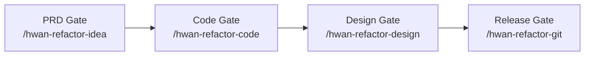
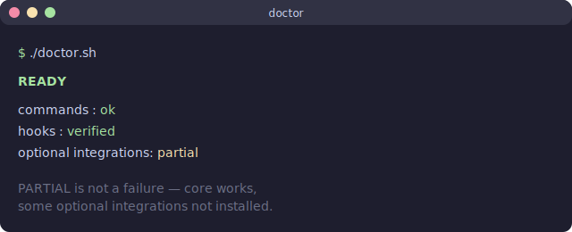
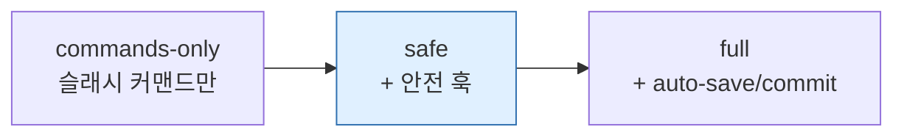

# Claude-Codex Vibekit (한국어)

> **또 하나의 AI 코딩 에이전트가 아닙니다.** Claude Code 사용자를 위한 로컬 품질 게이트 워크플로우(Codex CLI 선택 호환). PRD → 코드 → 디자인 → 릴리스, 각 단계에서 체크.

[](https://github.com/hwan96-ai/claude-codex-vibekit/actions/workflows/smoke-tests.yml)
[](https://github.com/hwan96-ai/claude-codex-vibekit/releases)
[](https://opensource.org/licenses/MIT)
[](https://claude.com/code)
[](https://github.com/openai/codex)

**English README**: [README.md](README.md)

## TL;DR

```bash
git clone https://github.com/hwan96-ai/claude-codex-vibekit.git
cd claude-codex-vibekit
./install.sh --mode safe         # PowerShell: .\install.ps1 -Mode safe
./doctor.sh                       #             .\doctor.ps1
```

Claude Code 안에서 먼저 audit-only로 게이트를 시도해 보세요:

```
/hwan-refactor-idea --audit-only
```

audit-only는 `SUMMARY.md`만 남기고 멈춥니다. 파일 수정 없음, 커밋 없음, 푸시 없음.

## 30초 요약

- **방향은 당신이 잡습니다.** PRD, 범위, 머지 결정은 모두 사람 몫.
- **코드는 Claude Code가 도와 씁니다.** Vibekit이 기능을 대신 짜주지 않습니다.
- **Vibekit은 `main`/릴리스 직전에 로컬 게이트**를 더할 뿐입니다.
- **먼저 `--audit-only`로** 시작하세요. 모든 게이트에 있고, 수정·커밋·푸시를 하지 않습니다.
- **자동 푸시·PR·머지·배포는 어떤 모드에서도 없음.**

**흐름:** **PRD → 코드 → 디자인 → 릴리스.** 각 게이트는 Claude Code 안에서
실행하는 슬래시 커맨드이고, 모든 게이트에 audit-only 모드가 있습니다.

<details>
<summary>워크플로우 다이어그램</summary>



</details>

## Before / After

| | Vibekit 없이 | Vibekit + audit-only |
|---|---|---|
| **결과물** | AI가 파일을 바꿔둠. 리스크 불분명. | P0/P1/P2/P3 정리된 게이트 요약. |
| **수정된 파일** | AI가 정한 만큼. | 없음 (audit-only는 `SUMMARY.md`만 작성). |
| **커밋 / 푸시** | 이미 일어났을 수도 있음. | 자동 없음. 결정은 본인. |
| **반복 가능성** | 세션마다 백지에서 시작. | 프로젝트 학습 노트가 이어집니다. |

기본은 audit-only입니다. 자동 수정·자동 커밋은 [설치](#설치) 섹션과
[`docs/SECURITY.md`](docs/SECURITY.md)에 정리된 옵트인 모드입니다.

자세한 흐름과 doctor의 `PARTIAL` 의미는 [`docs/EXAMPLE-RUN.md`](docs/EXAMPLE-RUN.md), [`docs/INSTALLATION.md`](docs/INSTALLATION.md)를 참고하세요.

## 왜 만들었나

AI 코딩 도구는 변경을 *쓰는* 데는 빠르지만, *무엇을 배포하면 안 되는지*에
대해 스스로 신중하지는 않습니다. Vibekit은 "AI가 diff를 만들었다"와
"그 diff가 `main` 또는 운영에 들어간다" 사이에 끼어들어 그 핸드오프 주변에
로컬 품질 게이트를 더합니다. 워크플로우에 대해서는 의견이 있고, 당신의
코드 자체에 대해서는 의견을 강제하지 않습니다.

## 무엇이 들어 있나

- **슬래시 커맨드 4개** — PRD, 코드, 디자인, 릴리스 게이트.
- **모든 게이트에서 audit-only 모드** — 파일 수정 없음, 커밋 없음, 푸시 없음.
- **선택적 git 안전 훅** — force push 차단, `main`/`master` 직접 커밋 차단,
  위험한 자동 커밋 거부.
- **doctor** — `READY` / `PARTIAL` / `ACTION REQUIRED` 상태와 누락 항목별
  한 줄 수정 명령 제공.
- **설치 스모크 체크** — 인스톨러가 훅이 실제로 컴파일되고 차단하기로 한 것을
  진짜 차단하는지 확인한 뒤에야 성공을 보고합니다.
- **`SHA256SUMS`** — 태그에 포함된 15개의 핵심 파일이 일치하는지 검증.

## 참고용 예시 출력

audit-only 실행의 형태입니다 (모양만 — 실제 출력은 다를 수 있고, **벤치마크가
아닙니다**):

```text
$ /hwan-refactor-code --audit-only

== Phase 1-3: 다관점 감사 ==
P0  (반드시 수정) : 0 건
P1  (수정 권장)   : 2 건  src/api/handler.ts, src/db/migrate.sql
P2  (가능하면)     : 5 건
P3  (메모)         : 3 건

수정한 파일:   없음 (audit-only)
커밋:          없음
푸시 시도:     없음
SUMMARY.md 작성됨
```

네 게이트의 전체 예시 흐름은 [`docs/EXAMPLE-RUN.md`](docs/EXAMPLE-RUN.md)를
참고하세요.

## 릴리스 후보 검증 (v0.2.5)

<p align="center">
  
</p>

아래는 이 저장소의 **v0.2.5 릴리스 후보** (PR #11 / #12 머지 후의
`main` 브랜치, 커밋 `0b3bc4c`)에 대해 통과한 체크입니다. **아직
`v0.2.5` 태그는 만들어지지 않았습니다** — 현재 최신 태그는 여전히
`v0.2.4`입니다. 태그가 생성되면 이 섹션은 "현재 릴리스 검증"으로
승격됩니다. 아래 항목들은 이 후보에 대한 사실이고, 앞으로의 모든
버전에 대한 일반적 주장이 아닙니다:

- 새 클론 + `--mode safe` 설치가 깨끗한 계정에서 오류 없이 완료됩니다.
- `doctor`의 훅 런타임 검증이 통과합니다 (Python 훅 컴파일,
  `block-dangerous-git.py`가 force push는 차단하고 일반 push는 통과,
  `settings.json` 안의 모든 훅 경로가 실재 파일을 가리킴).
- `bash scripts/generate-checksums.sh --check` 와
  `.\scripts\generate-checksums.ps1 -Check` 모두 `SHA256SUMS`에 대해 성공.
- Ubuntu / Windows CI 스모크 테스트 통과. PR #11에서 추가된 end-to-end
  `tests/smoke.sh` / `tests/smoke.ps1` 단계도 포함됩니다.
- `tests/test-auto-save.sh`, `tests/test-block-dangerous-git.py` 로컬
  실행 모두 통과 — PR #12의 훅 안전성 강화가 적용됨.

이 체크들은 설치된 키트와 릴리스 파일에 대한 것이지, 게이트를 당신의 코드에
돌리면 모든 버그를 잡아준다는 약속이 아닙니다.

## 이게 뭐야?

Vibekit은 **또 하나의 AI 코딩 에이전트가 아닙니다.** 기능을 대신 짜주지 않고, 푸시·머지·배포도 하지 않습니다.

대신 기존 Claude Code(또는 Codex CLI) 세션 위에 얹는 **로컬 품질 게이트 워크플로우**입니다:

1. **PRD 게이트** (`/hwan-refactor-idea`) — 코드 쓰기 전에 스펙 점검
2. **코드 게이트** (`/hwan-refactor-code`) — 개발 중간 코드 리뷰, 가능하면 TDD 우선
3. **디자인 게이트** (`/hwan-refactor-design`) — 상태 커버리지 매트릭스로 UI/UX 점검
4. **릴리스 게이트** (`/hwan-refactor-git`) — 배포 전 보안 / QA / 문서 점검

여기에 선택적인 git 안전 훅, 롤백 규칙, 프로젝트별 학습 노트가 더해져서 **반복되는 실수를 잡기 더 쉬워지는 정도**를 노립니다.

## 누구를 위한 거야?

- 바이브 코딩에 구조화된 리뷰 레이어가 필요한 Claude Code 파워 유저
- gstack / BMAD / superpowers / compound-engineering을 이미 쓰거나 설치할 의향이 있는 개발자
- 호스팅 리뷰 플랫폼에 돈 안 쓰고 로컬에서 품질 게이트를 굴리고 싶은 솔로/소규모 팀
- (선택) Codex CLI에서 두 번째 모델로 같은 게이트를 돌리고 싶은 사용자

## 누구한테는 안 맞아?

- 기능을 끝까지 알아서 짜주는 AI를 원하면 — Cursor / Aider / Cline / Continue를 추천합니다.
- 호스팅 대시보드, SSO, 감사 로그, 컴플라이언스 인증이 필요한 팀.
- 로컬 설정을 전혀 하기 싫은 사람. Vibekit은 `~/.claude` 아래에 슬래시 커맨드와 (선택적으로) 훅을 설치합니다.

## Cursor / Aider / Cline / Continue 와 뭐가 달라?

같은 일을 하는 도구가 아니라 **다른 레이어**입니다. 보완 관계지 경쟁 관계가 아닙니다.

| 도구 | 주된 역할 |
|------|----------|
| **Cursor**, **Aider**, **Cline** | 에디터나 터미널에서 AI가 코드를 쓰게 도와줌 |
| **Continue** | 개발/PR 워크플로우 안에서 AI 체크를 굴려줌 |
| **Vibekit** | Claude Code 워크플로우 주변의 로컬 품질 게이트 — PRD 게이트, 코드 게이트, 디자인 게이트, 릴리스 게이트, git 안전 훅, 롤백 규칙, 학습 노트 |

같이 써도 됩니다. AI가 코드 쓰는 건 다른 도구에 맡기고, Vibekit은 "이거 정말 배포해도 되나?" 에 답하는 쪽을 맡습니다.

## 왜?

바이브 코딩은 빠르지만 위험합니다:
- AI가 기존 기능을 깨먹는 걸 못 알아챌 수 있어요.
- 같은 종류의 리뷰 누락이 세션마다 반복돼요.
- 구조화된 리뷰가 없으면 프로덕션에서 사고가 더 자주 납니다.

Vibekit은 가벼운 안전 레이어를 더할 뿐, 휴먼 리뷰를 대체하지 않습니다. 기반:
- **gstack** — 리뷰 스킬 모음 (Garry Tan)
- **BMAD** — 구조화된 워크플로우 (PRD, 시장조사 등)
- **superpowers** — TDD, 체계적 디버깅 (obra)
- **compound-engineering** — 학습 누적 (EveryInc)

## 사전 준비

- [Claude Code](https://docs.anthropic.com/en/docs/claude-code)
- Node.js 20+
- Git, Python 3
- (선택) [Codex CLI](https://github.com/openai/codex)

## 설치

위의 TL;DR에 권장 경로(`--mode safe`)가 이미 적혀 있습니다. 이 섹션은
모드와 스코프를 고르기 위한 짧은 참조이고, 전체 가이드는
[`docs/INSTALLATION.md`](docs/INSTALLATION.md)에 있습니다.

Vibekit은 어떤 모드에서도 푸시·머지·배포를 자동으로 하지 않고
auto-commit도 몰래 켜지 않습니다.

### 설치 모드



| 모드 | 동작 | 대상 |
|------|------|------|
| `commands-only` | 슬래시 커맨드만 복사. 훅 없음. `settings.json` 손 안 댐. | 가장 안전. 잘 모르겠으면 우선 이걸로. |
| `safe` (권장) | `commands-only` + 안전 훅 활성화 (위험 git 차단, 세션 시작 브랜치 분기). auto-commit은 **꺼져 있음**. | 대부분의 사용자. |
| `full` | `safe` + auto-save / auto-commit. 훅이 `main`/`master`, 위험 파일(`.env`, 키류, `~/.claude/settings.json`), 시크릿 패턴, 삭제, 30개 초과 변경 시 커밋을 거부합니다. 통과해도 여전히 `git add -A`로 워킹 트리 전체를 스테이징할 수 있습니다. | 파워 유저 전용; 설치 스크립트가 먼저 명시적으로 경고. |

> **글로벌 vs 프로젝트 스코프.** `safe` / `full`에서 설치되는 훅은
> `~/.claude`에 있어서 이 사용자 계정의 **모든** Claude Code 세션에
> 적용됩니다. Claude 슬래시 커맨드와 훅을 `./.claude`에만 두고 싶다면
> `--scope project` (Bash) / `-Scope project` (PowerShell)을 쓰세요.
> 프로젝트 스코프는 `settings.local.json`을 사용하고, Vibekit 저장소
> 안에서 실행하면 명시적 확인(`--yes` / `-Yes`)을 요구합니다.
>
> **Codex 프롬프트는 항상 사용자 단위입니다.** Codex CLI는 커스텀
> 프롬프트를 `$CODEX_HOME/prompts` (기본값 `~/.codex/prompts`)에서만
> 읽습니다. 따라서 설치 스크립트는 `--scope` 값과 무관하게
> `codex-prompts/*.md`를 그 경로에 복사합니다. `--scope project`는
> Claude 쪽 설치 위치만 바꾸며, `$HOME` 하위의 Codex 프롬프트
> 쓰기까지 막아 주지는 **않습니다**.

### 선택적 통합

`doctor.sh` / `doctor.ps1`이 설치 여부와 누락된 항목별 한 줄 수정
명령을 알려줍니다:

- **gstack** — `~/.claude/skills/gstack`에 클론 (또는 `--bootstrap`).
- **BMAD** — `npx bmad-method install` (프로젝트별, 항상 수동).
- **superpowers**, **compound-engineering** — Claude Code의 `/plugins`
  UI로 설치 (항상 수동).
- **Codex CLI** — `npm install -g @openai/codex` (또는
  `--bootstrap --bootstrap-codex`).

doctor는 `READY`, `PARTIAL`, `ACTION REQUIRED` 중 하나로 끝납니다.
`PARTIAL`은 실패가 아닙니다 — 보통 "코어는 동작하고 선택적 통합이 아직
없음"을 뜻합니다.

### Opt-in 부트스트랩

기본 설치는 외부 도구를 건드리지 않습니다. `--bootstrap` (Bash) /
`-Bootstrap` (PowerShell)을 넘기면 **gstack**과 (`--bootstrap-codex`
/ `-BootstrapCodex` 추가 시) **Codex CLI**의 안전한 자동 설치를 옵트인할
수 있습니다. BMAD, superpowers, compound-engineering은 정확한 명령어와
함께 수동 단계로 안내됩니다. 기존 설치에 같은 패스를 돌리려면
`./doctor.sh --fix` / `.\doctor.ps1 -Fix`.

부트스트랩 옵션 전체, 스코프 결정 트리, `PARTIAL` 해석, `ACTION
REQUIRED` 대응, `full` 모드 경고의 상세는
[`docs/INSTALLATION.md`](docs/INSTALLATION.md)를 보세요.

## 4개 게이트

| 게이트 | 명령어 | 언제 |
|-------|--------|------|
| 1 PRD | `/hwan-refactor-idea` | PRD 작성 직후 |
| 2 코드 | `/hwan-refactor-code` | 개발 중간, 코드 리뷰가 필요할 때 |
| 3 디자인 | `/hwan-refactor-design` | UI 구현 후 UX 점검 |
| 4 릴리스 | `/hwan-refactor-git` | 배포/PR 직전 |

각 명령어 내부 단계 (대략):
```
Phase 0: 이전 학습 로드
Phase 1-3: 다관점 병렬 감사 (gstack + BMAD)
Phase 4-5: 우선순위 계획 (P0/P1/P2/P3)
Phase 6+: 수정 적용 (테스트 검증, 가능하면 회귀 시 롤백)
Phase 7+: 이번 세션 학습 캡처
```

### 공통 옵션

```bash
/hwan-refactor-code              # 기본 파이프라인
/hwan-refactor-code --quick      # 핵심만 빠르게
/hwan-refactor-code --audit-only # 검증만, 자동 수정 안 함
/hwan-refactor-code --dry-run    # 미리보기
/hwan-refactor-code --resume     # 중단된 곳부터 이어서
```

## 릴리스 파일 검증

각 태그 릴리스에는 15개의 핵심 파일(양쪽 OS의 install / doctor / uninstall
스크립트, 4개 훅, 5개 슬래시 커맨드)에 대한 `SHA256SUMS`가 포함됩니다.
태그를 받은 뒤 검증하려면:

```bash
git checkout v0.2.4
bash scripts/generate-checksums.sh --check
```
```powershell
git checkout v0.2.4
.\scripts\generate-checksums.ps1 -Check
```

두 스크립트는 바이트 단위로 동일한 출력(`<sha256>  <상대경로>`, 소문자 해시,
스페이스 2칸, 슬래시 경로)을 만들어내므로, Linux에서 검증한 클론과 Windows에서
검증한 클론이 정확히 일치합니다.

**`SHA256SUMS`가 보호하는 것:** 다운로드 중 파일 손상, 미러 변조, 부분 클론.
**보호하지 못하는 것:** 저장소 소유자 계정이 침해되어 악성 태그와 악성
`SHA256SUMS`가 함께 게시되는 경우. 움직이는 `main`보다는 **태그 릴리스**를
우선해서 받으세요. 전체 공급망 주의사항은
[`docs/SECURITY.md`](docs/SECURITY.md)를 참고하세요.

`safe`/`full` 인스톨러는 훅 복사 후에도 한 번 더 검증합니다 — 모든 훅 파일
존재 여부, Python 훅 컴파일, `block-dangerous-git.py`가 실제로 force push를
차단하고 정상 push는 통과시키는지. 한 가지라도 실패하면 인스톨러는 0이 아닌
종료 코드와 OS별 진단 절차를 출력하며 성공을 주장하지 않습니다.

## 안전 모델

Vibekit이 하는 것과 안 하는 것.

**모드와 무관하게 절대 자동으로 안 함:**
- 리모트에 푸시
- PR 생성
- 브랜치 머지
- 배포

**`--mode safe` 선택 시 추가:**
- PreToolUse 훅으로 위험한 git 명령(`git reset --hard`, `git push --force`, `git clean -f`, `main`/`master` 직접 커밋) 차단
- 세션이 `main`/`master`에서 시작되면 자동으로 `claude/session-*` 브랜치 생성
- `~/.claude/settings.json`은 수정 전 항상 백업

**`--mode full`에서 추가:**
- 파일 수정 후 auto-save / auto-commit. 훅은 `main`/`master`, 위험 파일(`.env`, `*.pem`, `*.key`, `~/.claude/settings.json` 등), 시크릿 패턴(`OPENAI_API_KEY`, `ANTHROPIC_API_KEY`, `BEGIN PRIVATE KEY`, `sk-…`), 삭제 변경(`HWAN_AUTOSAVE_ALLOW_DELETIONS=1`로 허용), `HWAN_AUTOSAVE_MAX_FILES`(기본 30) 초과 시 커밋을 거부합니다. 통과해도 여전히 `git add -A`로 워킹 트리 전체를 스테이징해서 관련 없는 변경까지 같이 커밋할 수 있습니다. 설치 스크립트가 먼저 명시적으로 경고합니다. 끄려면 `HWAN_AUTOSAVE_DISABLE=1` 또는 `safe`/`commands-only`로 다시 설치하세요.

테스트 검증, 롤백, TDD 우선, 프로젝트별 학습 노트는 기반 스킬들(gstack, BMAD, superpowers, compound-engineering)에서 옵니다 — doctor가 알려주는 대로 따로 설치하세요.

## 사용 예시

```bash
# 1. PRD는 직접 작성
vim PRD.md

# 2. 점검
claude
> /hwan-refactor-idea

# 3. 코딩 시작 (AI 도움, 본인이 지휘)
> PRD대로 사용자 인증 구현

# 4. 개발 중간 점검
> /hwan-refactor-code

# 5. UI 구현 후
> /hwan-refactor-design

# 6. 배포 직전
> /hwan-refactor-git

# 7. PR 생성/머지 결정은 본인이
gh pr create
```

## 다음에 볼 문서

문서를 순서대로 따라가고 싶다면:

1. [설치](docs/INSTALLATION.md) — 모드, 스코프, 부트스트랩 상세.
2. [예시 실행](docs/EXAMPLE-RUN.md) — 각 게이트가 어떻게 흘러가는지.
3. [보안](docs/SECURITY.md) — `safe` / `full`이 실제로 바꾸는 것.
4. [비교](docs/COMPARISON.md) — Cursor / Aider / Cline / Continue 와의 위치 차이.

## 문서

- [설치 가이드](docs/INSTALLATION.md)
- [보안 & 설치 모드](docs/SECURITY.md)
- [품질 게이트 워크플로우](docs/QUALITY-GATES.md)
- [아키텍처](docs/ARCHITECTURE.md)
- [Cursor / Aider / Cline / Continue 비교](docs/COMPARISON.md)
- [예시 실행 (참고용)](docs/EXAMPLE-RUN.md)
- [릴리스 / 퍼블리싱 체크리스트](docs/GITHUB-PUBLISHING.md)
- [Changelog](CHANGELOG.md) • [Roadmap](ROADMAP.md) • [Contributing](CONTRIBUTING.md)

## 기여

[CONTRIBUTING.md](CONTRIBUTING.md) 참고. v0.2.x가 안정화되는 동안에는 작고 집중된 PR이 가장 좋습니다. 특히 환영:
- 번역
- 설치 스크립트 스모크 테스트
- 더 정확한 플러그인 감지

## 라이선스

MIT. 자유롭게 사용.

## 크레딧

- [gstack](https://github.com/garrytan/gstack) — Garry Tan
- [BMAD-METHOD](https://github.com/bmad-code-org/BMAD-METHOD) — BMad Code
- [superpowers](https://github.com/obra/superpowers) — Jesse Vincent (obra)
- [compound-engineering-plugin](https://github.com/EveryInc/compound-engineering-plugin) — EveryInc

영감: [andrej-karpathy-skills](https://github.com/forrestchang/andrej-karpathy-skills).
