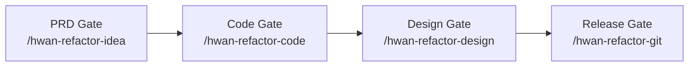
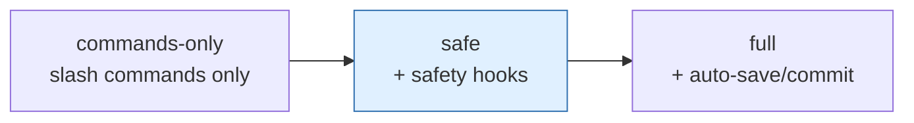

# Claude-Codex Vibekit

> **Not another AI coding agent.** A local quality-gate workflow for Claude Code users (Codex CLI optional). PRD → Code → Design → Release, with checks at each step.

[](https://github.com/hwan96-ai/claude-codex-vibekit/actions/workflows/smoke-tests.yml)
[](https://github.com/hwan96-ai/claude-codex-vibekit/releases)
[](https://opensource.org/licenses/MIT)
[](https://claude.com/code)
[](https://github.com/openai/codex)

**한국어 README**: [README.ko.md](README.ko.md)

## TL;DR

```bash
git clone https://github.com/hwan96-ai/claude-codex-vibekit.git
cd claude-codex-vibekit
./install.sh --mode safe         # PowerShell: .\install.ps1 -Mode safe
./doctor.sh                       #             .\doctor.ps1
```

Then, inside Claude Code, run a gate in audit-only mode first:

```
/hwan-refactor-idea --audit-only
```

Audit-only writes `SUMMARY.md` and stops. No file edits. No commits. No push.



> Text fallback: **PRD gate → Code gate → Design gate → Release gate.** Each gate
> is a slash command you run inside Claude Code. Audit-only mode is available on
> every gate.

## Why this exists

AI coding tools are fast at *writing* changes. They are not, by themselves,
careful about *what should not ship*. Vibekit sits between "AI wrote a diff"
and "the diff lands on `main` or production" and adds local quality gates
around that handoff. It is opinionated about workflow, not about your code.

## What you get

- **4 quality gates** as slash commands — PRD, Code, Design, Release.
- **Audit-only mode** on every gate (no file edits, no commits, no push).
- **Optional git safety hooks** — block force-push, block direct commits to
  `main`/`master`, refuse risky auto-commits.
- **Doctor** — `READY` / `PARTIAL` / `ACTION REQUIRED` status with one-line
  fix commands per missing item.
- **Install smoke checks** — installer verifies hooks compile and actually
  block what they claim to block before reporting success.
- **`SHA256SUMS`** — verify the 15 release-relevant files match the tag.

## Illustrative example

This is what an audit-only run looks like (shape only — your output will
differ; this is **not** a benchmark):

```text
$ /hwan-refactor-code --audit-only

== Phase 1-3: multi-perspective audit ==
P0  (must fix)   : 0 findings
P1  (should fix) : 2 findings  src/api/handler.ts, src/db/migrate.sql
P2  (nice fix)   : 5 findings
P3  (note)       : 3 findings

Files touched:  none  (audit-only)
Commits made:   none
Push attempted: no
Wrote: SUMMARY.md
```

See [`docs/EXAMPLE-RUN.md`](docs/EXAMPLE-RUN.md) for a full illustrative
walkthrough of all four gates.

## Current release verification (v0.2.1)

The following checks pass for the v0.2.1 tag of this repository. They are
release-specific, not a general claim about all future versions:

- Fresh clone + `--mode safe` install completes without errors on a clean
  account.
- `doctor` hook runtime verification passes (Python hooks compile,
  `block-dangerous-git.py` blocks a force push and allows a normal push,
  every configured hook path resolves to a real file).
- `bash scripts/generate-checksums.sh --check` and
  `.\scripts\generate-checksums.ps1 -Check` both succeed against the shipped
  `SHA256SUMS`.
- CI smoke tests pass on Ubuntu and Windows.

These checks are about the installed kit and the released files. They do
not promise that running a gate on your code will catch every bug.

## What is this?

Vibekit is **not another AI coding agent.** It does not write features for you, and it does not push, merge, or deploy.

It is a **local quality-gate workflow** that wraps your existing Claude Code (and optional Codex CLI) sessions with practical checks:

1. **PRD Gate** (`/hwan-refactor-idea`) — sanity-check your spec before writing code
2. **Code Gate** (`/hwan-refactor-code`) — review code mid-development, TDD-first where possible
3. **Design Gate** (`/hwan-refactor-design`) — audit UI/UX with a state coverage matrix
4. **Release Gate** (`/hwan-refactor-git`) — pre-deployment security / QA / docs check

Plus optional git safety hooks, rollback rules, and per-project learning notes so repeated mistakes become easier to catch.

See [`docs/EXAMPLE-RUN.md`](docs/EXAMPLE-RUN.md) for an illustrative walkthrough of all four gates and a "first 10 minutes" guide.

## Who is this for?

- Claude Code power users who want a structured review layer around vibe coding.
- Developers who already use, or are willing to install, gstack / BMAD / superpowers / compound-engineering.
- Solo developers and small teams who want a local quality gate without paying for hosted review platforms.
- Optional: Codex CLI users who want the same gates from a second model.

## Who is this NOT for?

- People looking for an AI that ships features end-to-end on its own — try Cursor / Aider / Cline / Continue instead.
- Teams that need hosted review dashboards, SSO, audit logs, or compliance certifications.
- Anyone who wants zero local configuration. Vibekit installs slash commands and (optionally) hooks into `~/.claude`.

## How is this different from Cursor / Aider / Cline / Continue?

Different layer of the stack. Vibekit complements rather than competes.

| Tool | Primary job |
|------|-------------|
| **Cursor**, **Aider**, **Cline** | Help AI write code in your editor or terminal |
| **Continue** | Run AI suggestions and checks inside the dev / PR workflow |
| **Vibekit** | Local quality gates around Claude Code workflows: PRD gate, code gate, design gate, release gate, git safety hooks, rollback rules, learning notes |

You can use Vibekit alongside any of these. It assumes you already have an AI helping you write code; it focuses on what to check before that code ships.

## Why?

Vibe coding is fast but risky:
- AI can break existing features without noticing.
- The same review oversight repeats across sessions.
- No structured review means more production surprises.

Vibekit adds a lightweight safety layer. It does not replace human review. It builds on:
- **gstack** — review skills (Garry Tan's setup)
- **BMAD** — structured workflows (PRD, market research, etc.)
- **superpowers** — TDD enforcement, systematic debugging (obra)
- **compound-engineering** — learning accumulation (EveryInc)

## Prerequisites

- [Claude Code](https://docs.anthropic.com/en/docs/claude-code)
- Node.js 20+
- Git, Python 3
- (Optional) [Codex CLI](https://github.com/openai/codex)

## Install

Vibekit installs the local Claude Code commands automatically, then checks optional integrations. It does **not** push, merge, deploy, or silently enable auto-commit.

### Recommended

**macOS / Linux / WSL:**
```bash
git clone https://github.com/hwan96-ai/claude-codex-vibekit.git
cd claude-codex-vibekit
./install.sh --mode safe
./doctor.sh
```

**Windows PowerShell:**
```powershell
git clone https://github.com/hwan96-ai/claude-codex-vibekit.git
cd claude-codex-vibekit
.\install.ps1 -Mode safe
.\doctor.ps1
```

The installer:
- detects your OS and home directory
- installs `/hwan-refactor-*` slash commands into `~/.claude/commands`
- copies hooks into `~/.claude/hooks`
- backs up and safely merges Claude Code settings
- checks gstack, BMAD, superpowers, compound-engineering, and Codex CLI
- tells you exactly what still needs manual setup

### Install modes



| Mode | What it does |
|------|--------------|
| `commands-only` | Safest. Copies slash commands only. No hooks. No `settings.json` changes. |
| `safe` (default recommendation) | `commands-only` + copies hooks + enables only safety hooks (block dangerous git, session-start branch safety). Auto-commit is **not** enabled. |
| `full` | `safe` + enables auto-save / auto-commit. The auto-save hook now refuses to commit on `main`/`master`, with risky files in the change set (`.env`, keys, `~/.claude/settings.json`), with obvious secret patterns in the diff, with deletions (unless opted in), or when more than 30 files change. If those checks pass it still runs `git add -A` and may stage unrelated working-tree changes — power-user only; the installer warns first. |

See [`docs/INSTALLATION.md`](docs/INSTALLATION.md) for "Which mode should I choose?", "What PARTIAL means", and the full mode/scope decision tree.

> **Global hook scope.** Hooks installed in `safe` or `full` mode live in `~/.claude` and apply to **every** Claude Code session on this user account, not just to this project. Choose `commands-only` for zero global side effects, or **project scope** (below) to confine everything to `./.claude`.

### Project-scoped install (new in v0.1.3)

If you don't want global side effects but still want hooks for a single
project, pass `--scope project` (Bash) / `-Scope project` (PowerShell):

```bash
./install.sh --mode safe --scope project        # writes to ./.claude
./install.sh --mode safe --claude-home /custom  # explicit path
```
```powershell
.\install.ps1 -Mode safe -Scope project
.\install.ps1 -Mode safe -ClaudeHome C:\custom
```

Project scope uses `settings.local.json` (Claude Code's machine-local
convention, typically gitignored). Running project-scope install inside the
Vibekit repo itself requires explicit confirmation (or `--yes` / `-Yes`).

### Try it safely first

Use audit-only mode before letting any gate modify files:

```
/hwan-refactor-idea --audit-only
/hwan-refactor-code --audit-only
/hwan-refactor-design --audit-only
/hwan-refactor-git --audit-only
```

For the safest install:

```bash
./install.sh --mode commands-only
```

### Optional integrations

`doctor.sh` / `doctor.ps1` will tell you which of these are present and how to install what's missing:

- **gstack** — clone into `~/.claude/skills/gstack` (or pass `--bootstrap`)
- **BMAD** — runs via `npx bmad-method install` per project (always manual; project-local)
- **superpowers**, **compound-engineering** — installed through Claude Code's `/plugins` UI (always manual)
- **Codex CLI** — `npm install -g @openai/codex` (or pass `--bootstrap --bootstrap-codex`)

The doctor exits with `READY`, `PARTIAL`, or `ACTION REQUIRED`.

### Opt-in bootstrap (new in v0.1.1)

The default install never touches external tools. Add `--bootstrap` (or
`-Bootstrap` on PowerShell) to opt in to safe automatic installs:

```bash
./install.sh --mode safe --bootstrap                  # interactive prompts
./install.sh --mode safe --bootstrap --yes            # non-interactive
./install.sh --mode safe --bootstrap --bootstrap-codex
```
```powershell
.\install.ps1 -Mode safe -Bootstrap
.\install.ps1 -Mode safe -Bootstrap -Yes
.\install.ps1 -Mode safe -Bootstrap -BootstrapCodex
```

What bootstrap can do automatically: clone+setup **gstack**, and (with
`--bootstrap-codex`) `npm install -g @openai/codex`. What it cannot:
**BMAD** (project-local), **superpowers** and **compound-engineering**
(plugin marketplace via Claude Code or Codex). Those remain manual with
exact commands printed.

`doctor --fix` / `doctor -Fix` runs the same opt-in pass against an
existing install:

```bash
./doctor.sh --fix
.\doctor.ps1 -Fix
```

## The 4 Gates

| Gate | Command | When to use |
|------|---------|-------------|
| 1 PRD | `/hwan-refactor-idea` | Right after writing your PRD |
| 2 Code | `/hwan-refactor-code` | Mid-development, code review needed |
| 3 Design | `/hwan-refactor-design` | UI implemented, UX needs polish |
| 4 Release | `/hwan-refactor-git` | Pre-deployment, before PR |

Each command runs 5 internal phases:

```
Phase 0: Load prior learnings (compound learning)
Phase 1-3: Multi-perspective parallel audit (gstack + BMAD)
Phase 4-5: Synthesize priority plan (P0/P1/P2/P3)
Phase 6+: Execute fixes (with test verification, auto-rollback)
Phase 7+: Capture session learnings (for next time)
```

### Common options

```bash
/hwan-refactor-code              # Full pipeline (default)
/hwan-refactor-code --quick      # Minimal viable check
/hwan-refactor-code --audit-only # Stop after findings, no auto-fix
/hwan-refactor-code --dry-run    # Preview only
/hwan-refactor-code --resume     # Continue from last incomplete run
```

## Verify release files

Each tagged release ships a `SHA256SUMS` file covering the 15 release-relevant
files (install / doctor / uninstall scripts on both platforms, all four hooks,
all five slash commands). To verify after cloning a tag:

```bash
git checkout v0.2.1
bash scripts/generate-checksums.sh --check
```
```powershell
git checkout v0.2.1
.\scripts\generate-checksums.ps1 -Check
```

Both scripts produce byte-identical output (`<sha256>  <relative/path>`,
lowercase hash, two spaces, forward-slash paths), so a clone verified on Linux
matches one verified on Windows.

**What `SHA256SUMS` protects against:** accidental file corruption during
download, mirror tampering, partial clones.
**What it does NOT protect against:** a compromised repository owner account
publishing a malicious tag alongside a malicious `SHA256SUMS`. Prefer
**tagged releases** over installing from a moving `main`. See
[`docs/SECURITY.md`](docs/SECURITY.md) for the full supply-chain note.

The `safe` and `full` installers also verify after copying hooks: every hook
file exists, Python hooks compile, and `block-dangerous-git.py` actually
blocks a force push and allows a normal push. If any check fails, the
installer exits non-zero and prints OS-specific diagnostic steps — it will
not claim success.

## Safety model

What Vibekit will and will not do.

**Never automatic, regardless of mode:**
- Pushing to a remote
- Creating pull requests
- Merging branches
- Deploying

**Optional, with `--mode safe`:**
- Block dangerous git commands (`git reset --hard`, `git push --force`, `git clean -f`, direct commits to `main`/`master`) via a PreToolUse hook.
- Auto-create a `claude/session-*` branch if a session starts on `main`/`master`.
- Back up `~/.claude/settings.json` before any modification.

**Additional with `--mode full`:**
- Auto-save / auto-commit on file edits. The hook now refuses to commit on `main`/`master`, with risky files in the change set (`.env`, `*.pem`, `*.key`, `~/.claude/settings.json`, …), with obvious secret patterns in the diff (`OPENAI_API_KEY`, `ANTHROPIC_API_KEY`, `BEGIN PRIVATE KEY`, `sk-…`), with deletions (unless `HWAN_AUTOSAVE_ALLOW_DELETIONS=1`), or when more than `HWAN_AUTOSAVE_MAX_FILES` (default 30) files change. If those checks pass, it still runs `git add -A` and commits the entire working tree — which can stage unrelated changes. The installer warns explicitly before enabling this. Set `HWAN_AUTOSAVE_DISABLE=1` to disable without uninstalling.

Test verification, rollback, TDD-first writing, and per-project learning notes come from the underlying skills (gstack, BMAD, superpowers, compound-engineering) — install them separately as the doctor reports.

## Example Workflow

```bash
# 1. Write your PRD manually (you, not AI)
vim PRD.md

# 2. Validate it
claude
> /hwan-refactor-idea

# 3. Start coding (AI helps, you direct)
> Build the user auth flow per PRD

# 4. Mid-development check
> /hwan-refactor-code

# 5. Once UI is up
> /hwan-refactor-design

# 6. Before deployment
> /hwan-refactor-git

# 7. Manually decide to merge PR
gh pr create
```

## What This Is NOT

- **Not** an auto-development tool. PRD is yours to write.
- **Not** auto-deployment. Merging and pushing to main is always your decision.
- **Not** a replacement for code review by humans on critical changes.

## What This IS

- A safety framework for vibe coding
- An orchestration layer over gstack + BMAD + superpowers + compound-engineering
- A way to accumulate project-specific knowledge across sessions

## Tech Stack

```
You write PRD
   ↓
gstack (30+ skills) + BMAD (34+ workflows) → audit
superpowers (TDD) → write tests before fixes
compound-engineering → accumulate learnings
   ↓
hwan-refactor-* 4 gates → orchestration
   ↓
git safety hooks → prevent accidents
   ↓
Reviewed code in a feature branch (you decide to merge)
```

## Documentation

- [Installation Guide](docs/INSTALLATION.md)
- [Security & install modes](docs/SECURITY.md)
- [Quality Gates Workflow](docs/QUALITY-GATES.md)
- [Architecture](docs/ARCHITECTURE.md)
- [Comparison with Cursor / Aider / Cline / Continue](docs/COMPARISON.md)
- [Example run (illustrative)](docs/EXAMPLE-RUN.md)
- [Release / publishing checklist](docs/GITHUB-PUBLISHING.md)
- [Changelog](CHANGELOG.md) • [Roadmap](ROADMAP.md) • [Contributing](CONTRIBUTING.md)
- [한국어 가이드](README.ko.md)

## Contributing

See [CONTRIBUTING.md](CONTRIBUTING.md). Smaller, scoped PRs are best while
v0.1.x is stabilizing. Especially welcome:
- Translations
- Installer smoke tests
- Better plugin detection
- Project-scoped install mode

## License

MIT. Use freely.

## Credits

Built on top of incredible open-source work:
- [gstack](https://github.com/garrytan/gstack) by Garry Tan
- [BMAD-METHOD](https://github.com/bmad-code-org/BMAD-METHOD) by BMad Code
- [superpowers](https://github.com/obra/superpowers) by Jesse Vincent (obra)
- [compound-engineering-plugin](https://github.com/EveryInc/compound-engineering-plugin) by EveryInc

Inspired by [andrej-karpathy-skills](https://github.com/forrestchang/andrej-karpathy-skills).
